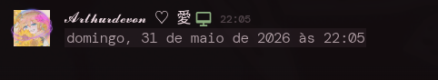

# showMyTime

Quick Vencord plugin to generate and send Discord timestamps using your local system clock.

## Previews

### Command Menu
The `/mytime` command with autocomplete options.

### Format Examples
A clean comparison of the available timestamp formats.

| Format Name | Argument | Output Preview | Description |
|---|:---:|---|---|
| **Relative Time** | `R` |  | Countdown (e.g., *in 10 minutes*) |
| **Full Date/Time**| `F` |  | Complete date and time string |
| **Short Time** | `t` |  | Just hours and minutes |

## How to use
Just type `/mytime` in any chat and pick a format:
* `R` - Relative time (countdown)
* `F` - Full date and time
* `t` - Short time (hours and minutes)

## Installation
1. Drop the `showMyTime` folder into your Vencord's `src/plugins/` directory.
2. Build Vencord (`pnpm buildStandalone`).
3. Enable `showMyTime` in your Vencord settings.