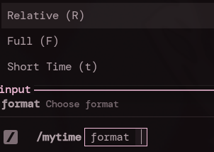
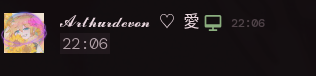

# showMyTime

Quick Vencord plugin to generate and send Discord timestamps using your local system clock.

## Previews

### Command Menu

### Formats Example
* **Relative Time (R):** 
* **Full Date/Time (F):** 
* **Short Time (t):** 

## How to use
Just type `/mytime` in any chat and pick a format:
* `R` - Relative time (countdown)
* `F` - Full date and time
* `t` - Short time (hours and minutes)

## Installation
1. Drop the `showMyTime` folder into your Vencord's `src/plugins/` directory.
2. Build Vencord (`pnpm buildStandalone`).
3. Enable `showMyTime` in your Vencord settings.